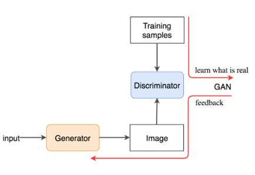
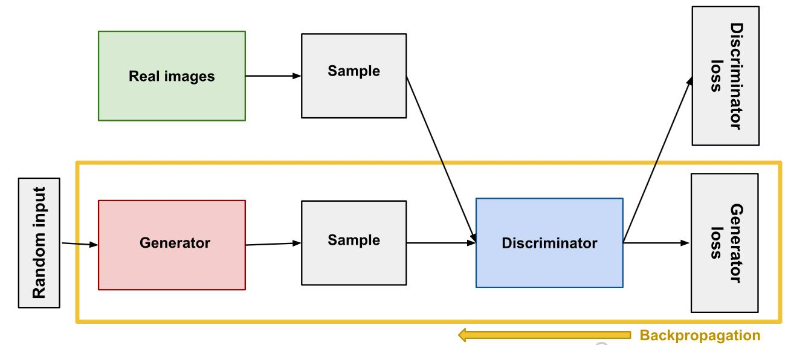

# GAN 
#### Generating Something from Nothing.

### Architecture of Basic GANs:

A generative adversarial network (GAN) has two parts:

The **generator** learns to generate plausible data. The generated instances become negative training examples for the discriminator.

The **discriminator** learns to distinguish the generator's fake data from real data. The discriminator penalizes the generator for producing implausible results.

### GANs OVERVIEW
When training begins, the generator produces obviously fake data, and the discriminator quickly learns to tell that it's fake:

As training progresses, the generator gets closer to producing output that can fool the discriminator:

Finally, if generator training goes well, the discriminator gets worse at telling the difference between real and fake. It starts to classify fake data as real, and its accuracy decreases.

### GAN Architure:
Generator will be trained in GAN model based on the output from discriminator. But discriminator will be freezed while training the GAN.

