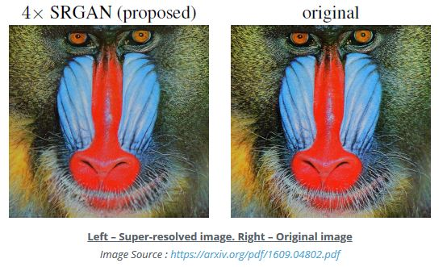

# Super Resolution GANS

SRGANs specialize in improving the resolution of the images.

Deep Convolutional GANs can super-resolve images but the finer texture details are often lost at large upscaling factors. An MSE based objective function can help in content loss minimization but still lead to low fidelity at higher resolutions.

The research paper 1609.04802 discusses Single Image Super Resolution GANs which can infer photo-realistic natural images for 4X upscaling factors.

SRGAN achieves this with a perceptual loss function which is a combination of an adversarial loss and a content loss. The new content loss optimizes perceptual similarity instead of pixel space similarity. The deep residual network of SRGAN is able to recover photo-realistic textures from deep downsampled images. A mean-opinion-score (human panel scoring) shows significant gains in perceptual resolution quality with SRGANs.

The Generator has many residual blocks followed by some Convolutional blocks. The Discriminator tries to mark the generated images as 0 and high-res real images as 1

We use Parametric ReLU or PReLU which has a learnable slope compared to a Leaky ReLU activation.

The GAN-part of the objective function of an SRGAN is formulated as follows :-

The Adversarial Loss part is the traditional GAN loss of Generator and is low-weighted with 0.001 weight. The Content Loss is the new thing here, which can calculated as MSE loss or the VGG loss.

The **MSE Content Loss** is comparing I-HR with Generated image and taking MSE over this difference.

The **VGG Content Loss** is taking the feature vector (phi-function) after the j-th convolution (after activation) but before the i-th maxpool layer within a VGG19 network.
